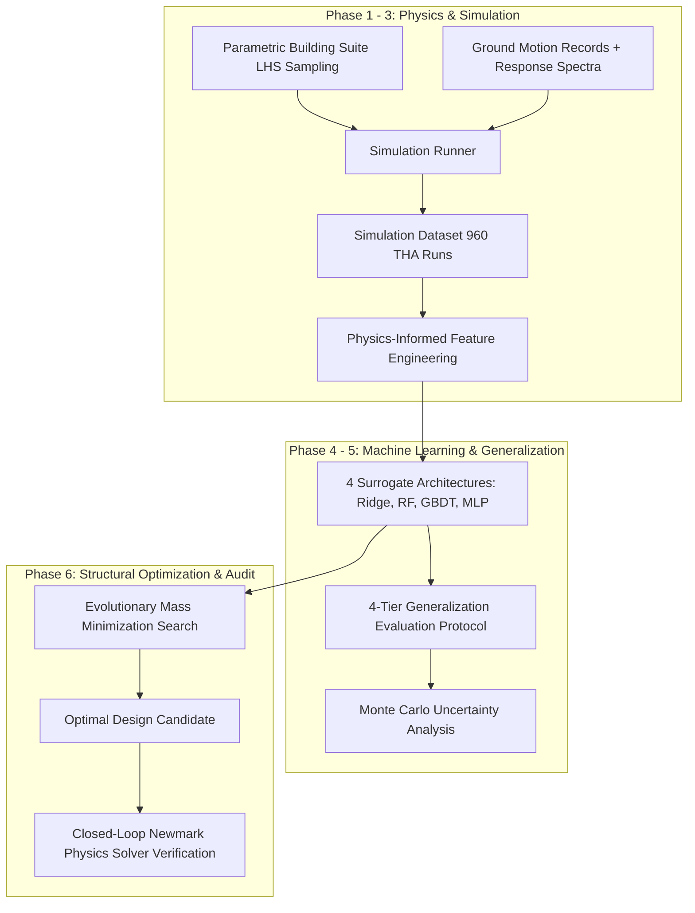

# Research Methodology & Workflow

## 1. Computational Pipeline Architecture
The Seismic-AI research workflow integrates physical modeling, signal processing, machine learning surrogate regression, and constrained optimization into a unified pipeline:

---

## 2. Experimental Setup
1. **Building Parameter Space**:
   - Storey count: $N \in [3, 10]$
   - Lumped floor mass: $m_i \in [60, 350]\,\text{tonnes}$
   - Storey shear stiffness: $k_i \in [40, 400]\,\text{MN/m}$
   - Storey height: $h_i \in [3.0, 4.2]\,\text{m}$
   - Damping ratio: $\zeta \in [0.02, 0.06]$
   - Total building instances: 40 distinct structures generated via Latin Hypercube Sampling (LHS).

2. **Ground Motion Suite**:
   - 8 historical records (El Centro, Kobe, Northridge, Loma Prieta, Chi-Chi, San Fernando, Imperial Valley, Friuli).
   - Intensity scaling factors (0.6x, 1.0x, 1.4x), yielding 24 distinct seismic accelerograms with PGA ranging from $0.15g$ to $1.20g$.

3. **Simulation Dataset**:
   - Total simulations: $40 \text{ buildings} \times 24 \text{ earthquakes} = 960$ full dynamic time-history simulations.
   - Simulation engine: Step-by-step Newmark-$\beta$ Average Acceleration integration ($\Delta t = 0.01\,\text{s}$).

---

## 3. Physics-Informed Feature Space
Instead of raw black-box coordinate inputs, features are derived from structural mechanics principles:
1. **Dynamic Modal Properties**: $T_1, T_2, T_3, T_2/T_1, \Gamma_1, M_1^*/M_{\text{tot}}$.
2. **Geometric & Material Properties**: $N, H_{\text{tot}}, M_{\text{tot}}, \bar{m}, \bar{k}, k_N/k_1, \zeta$.
3. **Earthquake Intensity Measures (IMs)**: $\text{PGA}, \text{PGV}, \text{PGD}, I_a, D_{5-95}, T_m, T_p$.
4. **Spectral Ordinates**: $S_a(T_1), S_a(T_2), S_a(T_3), S_d(T_1)$.
5. **Coupling Dimensionless Parameters**: $S_a(T_1)/\text{PGA}$, $T_1/T_p$, $T_1/T_m$, $\text{Drift Proxy} = \frac{M_1^* S_a(T_1)}{k_1 h_1}$.
